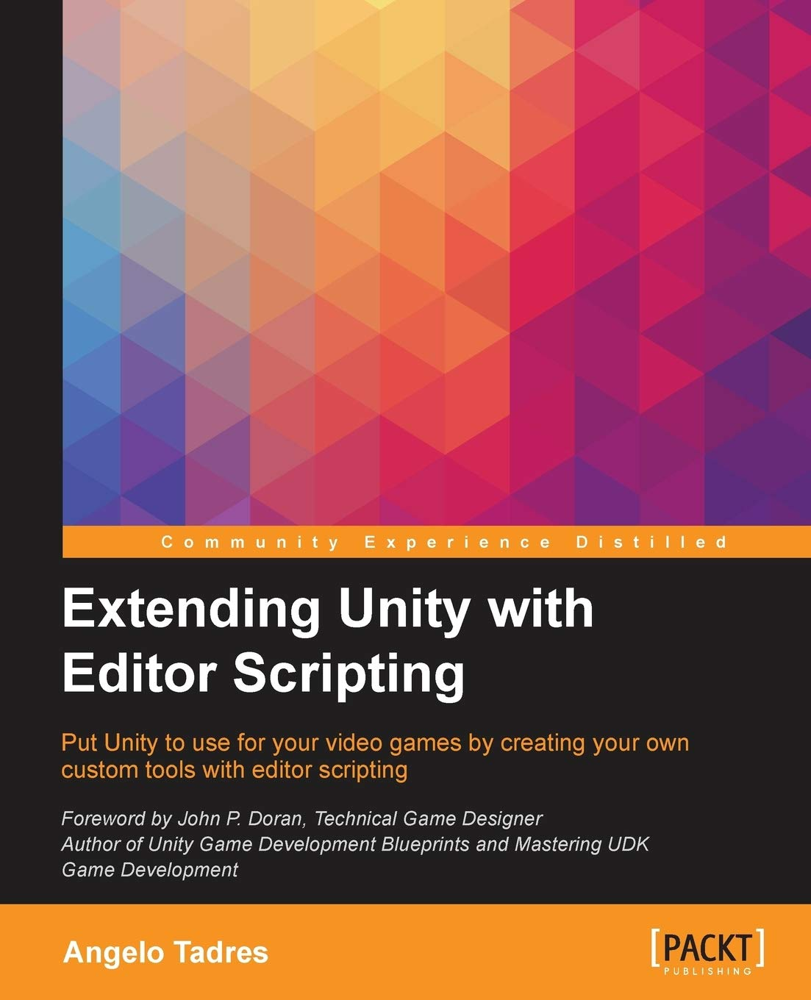

# AppBuilder 
A tool to help you in the build creation process. Part of the book [Extending Unity with Editor Scripting](https://www.packtpub.com/game-development/extending-unity-editor-scripting) published by *Packt Publishing* (Also available at [Amazon](https://www.amazon.com/Extending-Editor-Scripting-Angelo-Tadres/dp/1785281852)). 

> "This book is for anyone who has at least a basic knowledge of Unity programming using C# and wants to learn how to extend and create custom tools using Editor Scripting to improve the development workflow and make the video game development easier." 

## Requirements

You must to have Unity 5.x installed to run this project.

## Usage

1. Clone the project inside an Unity project using submodules.
2. Open the file Editor/Builder.cs and change the appBladeKey variable with your AppBlade token.

## License

**AppBuilder** is licensed under the [MIT license.](https://raw.githubusercontent.com/angelotadres/AppBuilder/master/LICENSE)
